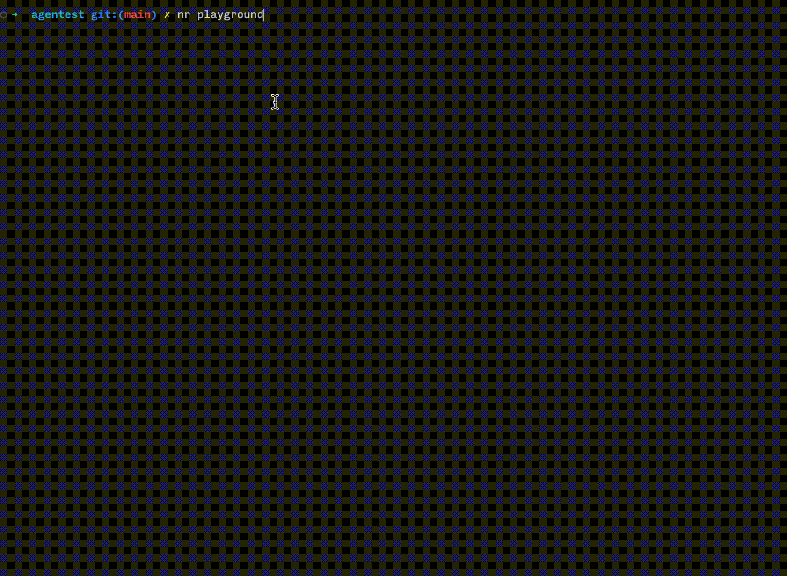

<p align="center">
  
</p>

> [!IMPORTANT]
> ⚡️ 面向 LLM / Agent 的轻量测试框架 — AI 界的 Vitest

[](https://www.npmjs.com/package/agentest-kit)
[](LICENSE)
[](package.json)
[](#)


<p align="center">
  
</p>

---

## 背景

传统单元测试的核心假设是**确定性**：相同输入始终产生相同输出，可以用 `expect(fn(x)).toBe(y)` 精确断言。AI 系统打破了这一假设：

| 挑战 | 说明 |
|------|------|
| **概率性输出** | 相同 query 每次响应不同，字符串精确匹配没有意义 |
| **意图驱动** | 用户关注的是"做了正确的事"，而非具体措辞 |
| **结构复杂** | 响应是 JSON + 自然语言的混合体，需要分层验证 |
| **阈值判断** | 低命中率可能是模型能力问题，需要统计指标而非 pass/fail 二值 |
| **多轮上下文** | 对话测试需要跨轮次传递 session 状态 |
| **秒级延迟** | 需要超时控制和异步调度，而非毫秒级本地函数 |

`agentest-kit` 专为这类场景设计，提供一套从测试注册、执行、断言到指标输出的完整工具链。

---

## 核心价值

- **零依赖**：Node.js ≥ 16 原生模块，无需额外安装
- **双模式**：数据驱动（JSON / 对象）+ 脚本驱动（自定义断言），自由混用
- **AI 专用断言**：`toHaveIntent()` / `toHaveKeyword()` / `toHitRate()` 等
- **阈值判断**：自动计算 Keyword Hit Rate / Intent Match Rate，低于阈值 exit 1
- **Skip / Todo**：类 Vitest 体验，跳过的用例不计入指标
- **适配器模式**：只需实现 `call + evaluate` 接口即可接入任意 AI 系统
- **CI 友好**：失败时 exit 1，可直接接入 GitHub Actions / Jenkins

---

## 快速开始

### 安装

```bash
npm install agentest-kit
# 或
yarn add agentest-kit
```

> 想直接跑起来看效果？跳到 [Playground →](#playground)

---

### 3 步接入

**第一步：实现适配器**（对接你的 AI 系统）

```js
// adapters/my-llm.js
import { defineAdapter } from 'agentest-kit';

export function createMyAdapter(config) {
    return defineAdapter({
        async call(testCase) {
            const start = Date.now();
            let raw = null, error = null;
            try {
                raw = await fetch(`${config.apiUrl}/chat`, {
                    method: 'POST',
                    body: JSON.stringify({ query: testCase.query }),
                }).then(r => r.json());
            } catch (e) {
                error = e.message;
            }
            return { case_id: testCase.case_id, query: testCase.query,
                     elapsed_ms: Date.now() - start, error, raw };
        },

        evaluate(callResult, testCase) {
            const { error, raw } = callResult;
            const structure_ok   = !error && raw?.code === 0;
            const intent_matched = structure_ok && raw?.intent === testCase.intent;
            return {
                ...callResult,
                structure_ok,
                intent_matched,
                keyword_hits:     [],
                keyword_hit_rate: null,
                quality_score:    structure_ok ? 5 : 0,
                failure_details:  [],
            };
        },
    });
}
```

**第二步：编写测试用例**（`cases.json`，零代码）

```json
[
  {
    "case_id": "C001",
    "query": "我的订单已经三天了还没发货，帮我查一下",
    "expected_keywords": ["order_tracking"],
    "difficulty": "easy"
  },
  {
    "case_id": "C002",
    "query": "App 升级后一直闪退，无法正常登录",
    "expected_keywords": ["technical_support", "account_management"],
    "difficulty": "medium"
  },
  {
    "case_id": "C003",
    "query": "暂时有问题，先跳过",
    "skip": true
  }
]
```

字段全部可选，只有 `case_id` 和 `query` 是必填。`skip: true` 跳过该 case，`todo: true` 标记待实现，两者均不计入指标。

**第三步：编写入口**（`evaluator.js`）

```js
// evaluator.js
import fs from 'node:fs';
import { fileURLToPath } from 'node:url';
import {
    runSuite, fromJsonCases,
    calcMetrics, judgeShipability, getTestStatus,
    printSummary, printMetrics, printShipVerdict,
} from 'agentest-kit';
import { createMyAdapter } from './adapters/my-llm.js';

const cases = JSON.parse(
    fs.readFileSync(new URL('./cases.json', import.meta.url), 'utf8')
);

async function main() {
    const adapter    = createMyAdapter({ apiUrl: process.env.MY_API_URL });
    const tests      = fromJsonCases(cases);
    const thresholds = { keyword_hit_rate: 0.70, intent_match_rate: 0.80 };

    const results = await runSuite(tests, adapter);
    const metrics = calcMetrics(results);

    printSummary(results, getTestStatus);
    printMetrics(metrics, thresholds);

    const ship = judgeShipability(metrics, thresholds);
    printShipVerdict(ship);
    if (!ship.can_ship) process.exit(1);
}

main().catch(err => { console.error('Fatal:', err.message); process.exit(1); });
```

**运行：**

```bash
node evaluator.js
```

大多数场景到这里就够了。如果需要自定义断言或多轮对话，见下方[进阶：JS 测试脚本](#进阶js-测试脚本)。

---

## 进阶：JS 测试脚本

`cases.json` 无法满足时（需要自定义断言、多轮对话、动态生成用例），在 `tests/` 目录新建 `*.test.js`，启动时自动发现并加载。

```js
// tests/advanced.test.js
import { test } from 'agentest-kit';

// 自定义断言
test('技术支持', async (ctx) => {
    const result = await ctx.run('App 升级之后一直崩溃，无法正常打开');
    ctx.expect(result).toHaveStructure();
    ctx.expect(result).toHaveIntent('technical_support');
    ctx.expect(result.quality_score).toBeGreaterThan(3);
});

// 多轮对话
test('追问场景', async (ctx) => {
    const r1 = await ctx.run('帮我查一下最新的订单物流');
    ctx.expect(r1).toHaveIntent('order_tracking');

    const sessionId = r1.raw?.data?.sessionId;
    const r2 = await ctx.run({ query: '这个订单能申请退款吗？', sessionId });
    ctx.expect(r2.intent_matched).toBe(true);
});

// 跳过 / 占位
test.skip('待修复 — 已知问题', { query: '...' });
test.todo('多意图组合场景');
```

在 `evaluator.js` 中合并两种来源：

```js
import fs   from 'node:fs';
import path from 'node:path';
import { fileURLToPath } from 'node:url';
import { fromJsonCases, fromRegistered, getRegistered, runSuite } from 'agentest-kit';

const __dirname = fileURLToPath(new URL('.', import.meta.url));

// 加载 tests/ 目录（自动发现 *.test.js）
const TESTS_DIR = path.join(__dirname, 'tests');
if (fs.existsSync(TESTS_DIR)) {
    const files = fs.readdirSync(TESTS_DIR).filter(f => f.endsWith('.test.js')).sort();
    for (const f of files) await import(path.join(TESTS_DIR, f));
}

const cases = JSON.parse(fs.readFileSync(path.join(__dirname, 'cases.json'), 'utf8'));
const tests = [
    ...fromJsonCases(cases),                // 数据驱动
    ...fromRegistered(getRegistered()),      // 脚本驱动
];
const results = await runSuite(tests, adapter);
```

---

## API 参考

### `test(name, defOrFn)`

注册一个测试用例。

```js
import { test } from 'agentest-kit';
```

| 参数 | 类型 | 说明 |
|------|------|------|
| `name` | `string` | 用例名称（终端显示用） |
| `defOrFn` | `object \| async function` | 数据对象或测试函数 |

**数据对象字段：**

| 字段 | 类型 | 说明 |
|------|------|------|
| `query` | `string` | 输入的自然语言 query |
| `expected_keywords` | `string[]` | 期望命中的关键词 / category ID |
| `intent` | `string` | 意图标签（描述用，适配器可读取） |
| `difficulty` | `string` | `easy` / `medium` / `hard` |
| `notes` | `string` | 备注 |

**测试函数签名：** `async (ctx) => void`

---

### `test.skip(name, defOrFn)` / `test.todo(name)`

```js
test.skip('临时跳过 — 待修复', { query: '...' });
test.todo('多意图组合 — 尚未实现');
```

Skip / Todo 用例**不计入**指标，终端显示 `SKIP` / `TODO` 徽章。

---

### `ctx` 对象（脚本驱动）

在 `test(name, async (ctx) => { ... })` 内可用：

| 属性 / 方法 | 说明 |
|-------------|------|
| `ctx.run(input)` | 调用适配器，传 `string` 或 `{ query, expected_keywords?, sessionId?, ... }` |
| `ctx.expect(value)` | 返回 `Expect` 断言对象 |
| `ctx.adapter` | 原始适配器，高级场景直接使用 |

---

### `expect(value)` — 断言库

**通用断言：**

```js
expect(x).toBe(y)
expect(x).toEqual(y)               // 深比较（JSON stringify）
expect(x).toBeTruthy()
expect(x).toBeFalsy()
expect(x).toBeNull()
expect(x).toContain(item)          // 数组或字符串
expect(x).toBeGreaterThan(n)
expect(x).toBeGreaterThanOrEqual(n)
expect(x).toBeLessThan(n)
expect(x).not.toBe(y)              // .not 否定链
```

**AI 专用断言（作用于适配器返回的标准 result 对象）：**

| 断言 | 说明 |
|------|------|
| `expect(result).toHaveStructure()` | `result.structure_ok === true` |
| `expect(result).toHaveIntent('account_report')` | `result.normalized_categories` 包含指定 ID |
| `expect(result).toHaveKeyword('消费')` | `result.keyword_hits` 包含指定词 |
| `expect(result).toMention('关键词')` | 原始响应 JSON 字符串包含此词 |
| `expect(result).toHitRate(0.7)` | `result.keyword_hit_rate >= 0.7` |

---

### `defineAdapter(adapter)`

校验并返回适配器对象，不满足接口时抛 `TypeError`：

```js
import { defineAdapter } from 'agentest-kit';

const adapter = defineAdapter({
    async call(testCase)          { /* HTTP 调用 */ },
    evaluate(callResult, testCase) { /* 解析 + 评分 */ },
});
```

---

### 执行引擎

```js
import { runSuite, fromJsonCases, fromRegistered } from 'agentest-kit';
import fs from 'node:fs';

// 将 cases.json 数组转换为内部 TestCase 格式
const cases  = JSON.parse(fs.readFileSync(new URL('./cases.json', import.meta.url), 'utf8'));
const tests1 = fromJsonCases(cases);

// 将 test() 注册的用例转换为内部 TestCase 格式
const tests2 = fromRegistered(getRegistered());

// 合并后运行
const results = await runSuite([...tests1, ...tests2], adapter, {
    label:  'my-suite',   // 终端标题
    apiUrl: 'http://...',  // 显示用
});
```

---

### 指标与阈值

```js
import { calcMetrics, judgeShipability } from 'agentest-kit';

const metrics = calcMetrics(results);
// → { total, keyword_hit_rate, intent_match_rate, avg_quality_score, avg_latency_ms }

const thresholds = { keyword_hit_rate: 0.70, intent_match_rate: 0.80 };
const ship = judgeShipability(metrics, thresholds);
// → { can_ship: boolean, issues: string[] }
```

| 指标 | 定义 | 建议阈值 |
|------|------|---------:|
| **Keyword Hit Rate** | 有 `expected_keywords` 的 case 中，关键词平均命中率 | ≥ 70% |
| **Intent Match Rate** | 所有 active case 中，`intent_matched = true` 的比例 | ≥ 80% |

Skip / Todo 用例**不计入**统计。

---

## 标准 Result 接口

适配器的 `evaluate()` 必须返回以下标准字段（框架依赖这些字段计算指标和渲染输出）：

```typescript
interface StandardResult {
    case_id:          string;
    query:            string;
    elapsed_ms:       number;
    error:            string | null;       // 请求失败时的错误信息
    structure_ok:     boolean;             // 响应结构是否完整
    intent_matched:   boolean;             // 是否匹配预期意图
    keyword_hits:     string[];            // 命中的关键词列表
    keyword_hit_rate: number | null;       // 命中率，null = 无 expected_keywords
    quality_score:    number;              // 0–5 综合评分
    failure_details:  string[];            // 供终端展示的失败诊断行（可选）
    // 适配器可附加任意额外字段供脚本测试使用（如 normalized_categories、raw 等）
}
```

---

## 接入新 AI 系统

新建 `adapters/my-system.js`，实现 `call + evaluate`，其余代码无需改动：

```js
import { defineAdapter } from 'agentest-kit';

export function createMySystemAdapter(config) {
    return defineAdapter({
        async call(testCase) {
            const start = Date.now();
            let raw = null, error = null;
            try {
                raw = await callMySystemAPI(testCase.query, config);
            } catch (e) {
                error = e.message;
            }
            return { case_id: testCase.case_id, query: testCase.query,
                     elapsed_ms: Date.now() - start, error, raw };
        },

        evaluate(callResult, testCase) {
            const { error, raw } = callResult;
            const structure_ok = !error && raw?.status === 'ok';

            // 将系统专有的意图字段映射到标准 intent_matched
            const responseIntent  = raw?.data?.intent_type;
            const intent_matched  = structure_ok
                && (!testCase.intent || responseIntent === testCase.intent);

            // 将系统专有的关键词命中映射到标准字段
            const keyword_hits    = (testCase.expected_keywords || [])
                .filter(kw => JSON.stringify(raw).includes(kw));
            const keyword_hit_rate = testCase.expected_keywords?.length
                ? keyword_hits.length / testCase.expected_keywords.length
                : null;

            return {
                ...callResult,
                structure_ok,
                intent_matched,
                keyword_hits,
                keyword_hit_rate,
                quality_score:   structure_ok ? 5 : 0,
                failure_details: intent_matched ? [] : [`intent: expected ${testCase.intent}, got ${responseIntent}`],
                // 附加字段（可选，供脚本测试使用）
                raw_intent: responseIntent,
            };
        },
    });
}
```

---

## Playground

本仓库提供两个开箱即用的示例，使用内置 Mock 适配器，**无需任何 API Key**，`node` 直接运行：

```bash
# 简单版 — 5 分钟了解核心概念（数据驱动）
node playground/simple/run.js

# 高阶版 — 脚本驱动、多轮对话、.not 断言、阈值判断
node playground/advanced/run.js
```

详见 [playground/README.md](playground/README.md)。

---

## 技术设计

### 架构分层

```
┌──────────────────────────────────────────────────┐
│          你的 evaluator.js（入口）                │  配置 + CLI + 加载测试文件
└────────────────────┬─────────────────────────────┘
                     │ import from 'agentest-kit'
┌────────────────────▼─────────────────────────────┐
│              agentest-kit                      │  框架层（与 AI 系统无关）
│  ┌──────────┐  ┌──────────┐  ┌────────────────┐  │
│  │ runner   │  │ metrics  │  │    reporter    │  │
│  │ runSuite │  │ calcMetr │  │  ANSI / badge  │  │
│  │ fromJson │  │ judgeShip│  │  printSummary  │  │
│  └────┬─────┘  └──────────┘  └────────────────┘  │
│  ┌────▼──────────────────────────────────────┐    │
│  │  define-test  │  expect                   │    │
│  │  test/skip/   │  toBe / toHaveIntent /    │    │
│  │  todo / fn    │  toHitRate / ...          │    │
│  └───────────────────────────────────────────┘    │
└────────────────────┬─────────────────────────────┘
                     │  defineAdapter({ call, evaluate })
┌────────────────────▼─────────────────────────────┐
│           adapters/your-system.js                 │  AI 系统专有层（你维护）
│  call → HTTP 请求  /  evaluate → 解析 + 评分     │
└──────────────────────────────────────────────────┘
```

### 核心数据流

```
cases.json ──────┐
                 ├── fromJsonCases()  ──┐
tests/*.test.js  │                      │
  └─ test()      ├── fromRegistered() ──┤
                 │                      ▼
                 └──── allTests ──── runSuite(tests, adapter)
                                           │
                               adapter.call(tc)        [HTTP / 任意 API]
                               adapter.evaluate()      [解析 + 评分]
                                           │
                                    StandardResult[]
                                           │
                               calcMetrics + judgeShipability
                                           │
                              reporter.print* → 终端输出
                                           │
                                      exit(0 or 1)
```

### 内部 TestCase 格式

```js
{
    id:                string,                // 'C001'（JSON）或 'T001'（JS 自动生成）
    name:              string,                // 显示名
    status:            'active'|'skip'|'todo',
    query:             string | null,
    expected_keywords: string[],
    fn:                async function | null, // 脚本驱动时非 null
}
```

### 函数式测试上下文（ctx）

`ctx.run(input)` 内部调用 `adapter.call + adapter.evaluate`，返回标准 result，支持在 `fn` 内多次调用（多轮对话）。`ctx.expect` 抛出 `AssertionError` 时测试立即标记为 FAIL，不影响其他用例。

### 模块注册机制

`define-test.js` 维护一个模块级 `_registry` 数组。Node.js ESM 模块缓存保证同进程内所有 `import 'agentest-kit'` 共享同一实例，因此 `tests/*.test.js` 中调用的 `test()` 对 `getRegistered()` 可见——无需显式传参或依赖注入。

---

## 扩展路线

| 能力 | 实现路径 |
|------|---------|
| **并发执行** | `runner.js` 的串行循环改为 `Promise.all` + 并发控制 |
| **重试机制** | TestCase 加 `retry: number` 字段，runner 捕获失败后重试 |
| **LLM 评分** | `evaluate()` 中调用 LLM API 做语义评分，取代规则评分 |
| **快照测试** | `evaluate()` 保存 normalized 结果快照，下次自动对比 |
| **HTML 报告** | reporter 增加 `saveHtmlReport(results)` |
| **Watch 模式** | 监听 `tests/*.test.js` 变化，自动重跑受影响的 case |

---

## Contributing

欢迎提交 Issue 和 PR！

```bash
git clone https://github.com/Sunny-117/agentest.git
cd agentest
node playground/simple/run.js    # 验证环境正常
```

---

## License

[MIT](LICENSE)
